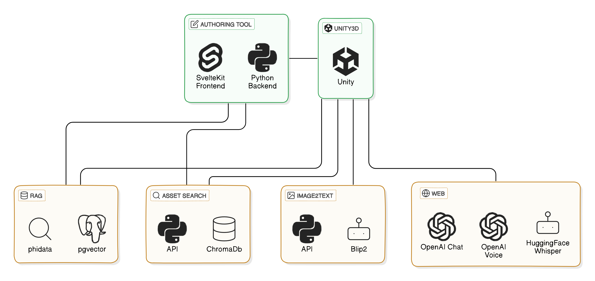

# Enhancing Interactivity and Cognition in 3D Scenes Using Large Language Models

## Directory Overview

This project comprises several components, including a Unity project, an annotation tool, and various supporting services. Additionally, it features an automated labeling solution.

| Subdirectory       | Description                                                                                                                                      |
|--------------------|--------------------------------------------------------------------------------------------------------------------------------------------------|
| 01-authoring tool  | User interface for uploading, searching, and annotating 3D models, loading models into the scene, and uploading documents for the LLM.          |
| 02-asset-search    | API-exposing 3D model search tool.                                                                                                              |
| 03-rag             | RAG (Retrieval-Augmented Generation) service with API endpoints for document uploads and prompt processing, using pgvector and Phidate.         |
| 04-object-labeling | Code for automated object labeling using BLIP and Pyrender. See the corresponding [README](./04-object-labeling/README.md) for usage details.   |
| 05-caption-api     | Image captioning API. Note: For faster inference, use the CUDA version of PyTorch instead of the default CPU version, which is provided for compatibility reasons. |

## How to Run

### Authoring Tool and Assistant Services

To simplify running all services except the Unity project, we use Docker Compose.

**Notes for asset search:**
- The first search may take some time as it needs to download embeddings. Check the logs for progress.
- This version uses only 30,000 entries to save space, which might impact performance.

#### Steps:
1. Clone the project repository.
2. Navigate to the project directory.
3. Run the command: `docker-compose up --build`

### Unity Project

1. Install Unity Hub and start it.
2. Add the Unity directory from this project to Unity Hub.
3. Unity should automatically suggest installing Unity 2021.3; if not, install it manually.
4. Within the Unity Editor, navigate to the scene folder and select a scene.
5. Open the Game tab and set the resolution to "Full HD (1920x1080)" to ensure the UI scales correctly.
6. Press the Play button to start the scene.

### (Optional) Automated Labeling

For instructions on using the automated labeling feature, please refer to the [README](./04-object-labeling/README.md) in the `04-object-labeling` directory.